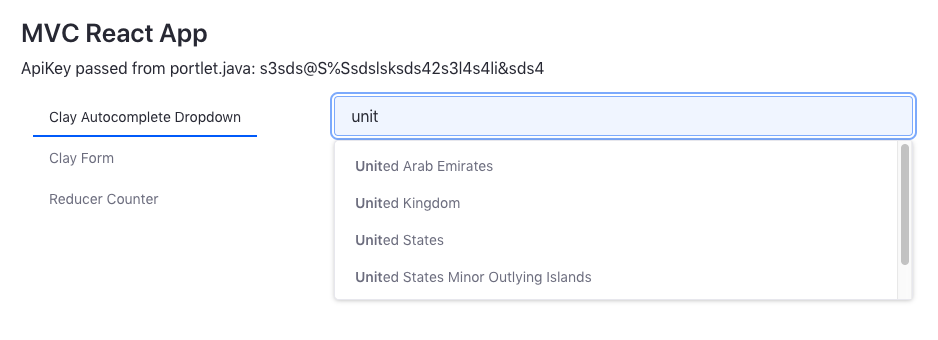

# MVC React Portlet

A sample Liferay portlet built to highlight best practices, built and tested for Liferay CE 7.3.1 GA2.

This is a discussion that is in progress and has yet to be solidified.



## Includes

Passing constants from `portlet.java` to React. 

Renders React using the Liferay `<react:component>` tag.

```
<react:component
	data="<%= data %>"
	module="js/Index.es"
/>
```

Includes the use of [Clay React Components](https://clayui.com/docs/components/index.html) such as:
* [@clayui/autocomplete](https://clayui.com/docs/components/autocomplete.html)
* [@clayui/button](https://clayui.com/docs/components/buttons.html)
* [@clayui/data-provider](https://clayui.com/docs/components/data-provider.html)
* [@clayui/drop-down](https://clayui.com/docs/components/drop-down.html)
* [@clayui/form](https://clayui.com/docs/components/forms/form.html)
* [@clayui/tabs](https://clayui.com/docs/components/tabs.html)

## How to Build and Deploy to Liferay

### Build it
` $ ./gradlew build `
The jar file will be in `build/libs/com.liferay.mvc.react.portlet-1.0.0.jar`.

### Deploy to Liferay
` $ ./gradlew deploy -Pauto.deploy.dir="/path/to/liferay/deploy"`